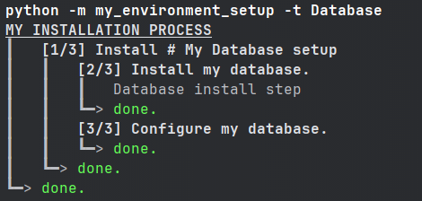
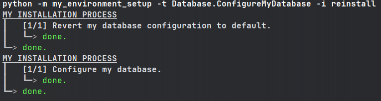

# Install process

For a better experience, check the docs: https://install_process.readthedocs.io/

A library to help you define your installation processes.


## What is ``install_process`` ?

This library's goal is to help you create an installation process for any kind of application / environment.  

With ``install_process``, you can define your entire installation process as a couple of small "install-steps",
which are then executed one after the other.  
When defining your install-steps, ``install_process`` also handles what needs to be done when you need to 
uninstall/reinstall part or the entirety of your install-process.

This lib can be compared to tools like [ANSIBLE](https://www.ansible.com/), but for much simpler and local scopes
*(while still being easily callable with ANSIBLE if finally your project grows big enough)*.

This lib has no dependencies to be easily installed on computers without internet access.

This is an effort to replace old Windows/Linux scripts with Python scripts
(check [here](https://github.com/ninjaaron/replacing-bash-scripting-with-python) for more details).
It is tested on Linux/Windows (not tested on Mac — though it should probably work just fine).

## Install

```shell
pip install install_process
```

## Quick-start

### Case

Let's suppose you need to set up your environment, and for that you need to:
1. install an SQL database
2. configure the database
3. unzip a file at a certain location

You could use install_process to define:
- The database installation & uninstallation process
  - the database install & uninstall
  - the database configuration & revert to default config
- Unzip the file & remove the file

### The code

Here's how you could do this using ``install_process``:

```python
# file: my_environment_setup.py

from install_process import InstallStep, InstallSteps, InstallProcess, setup_install


class InstallMyDatabase(InstallStep):  # The database installation & uninstallation process
  def install(self) -> None:
    """Install my database."""  # This docstring will actually be displayed during the installation process
    # do what's required to install your database here
    # you can display messages to users if you want
    self.display.msg('Database install step')
    # you can call shell commands such as ``self.shell('install mysql')``

  def uninstall(self) -> None:
    """Uninstall my database."""  # This docstring will actually be displayed during the uninstallation process
    # do what's required to uninstall your database here


class ConfigureMyDatabase(InstallStep):  # The database configuration & revert to default process
  def install(self) -> None:
    """Configure my database."""
    # do what's required to configure your database here

  def uninstall(self) -> None:
    """Revert my database configuration to default."""
    # do what's required to revert configuration here


class Database(InstallSteps):  # Let's regroup database-install & database-config under a same step (optional)
  """My Database setup"""  # This docstring will actually be displayed
  steps = [
    InstallMyDatabase(),
    ConfigureMyDatabase(),
  ]


class UnzipMyFile(InstallStep):  # Unzip the file & remove the file
  def install(self) -> None:
    """Unzip my file."""
    # unzip your file where required here

  def uninstall(self) -> None:
    """Remove my file."""
    # remove your file here


class SetupMyEnvironment(InstallProcess):  # Put everything together
  """MY INSTALLATION PROCESS"""  # This docstring will actually be displayed
  steps = [
    Database(),  # Database install & config
    UnzipMyFile(),  # File unzipping
  ]


if __name__ == '__main__':
  setup_install(SetupMyEnvironment)
```

### Launch install, uninstall, reinstall

Now you can install your entire environment:
```commandline
python -m my_environment_setup
```


Uninstall your entire environment, using the `-i` option:
```commandline
python -m my_environment_setup -i uninstall
```


Uninstall then install the entire environment:
```commandline
python -m my_environment_setup -i reinstall
```

### Re-install only a specific part

If you wish to only install/uninstall/reinstall a specific part of your environment, you can do so by providing
the name of the step you want to install/uninstall/reinstall.

To get the name of all steps (this does not install or uninstall anything):
```commandline
python -m my_environment_setup -n
```


Then you can call only a subset of your installation process:
```commandline
python -m my_environment_setup -t Database
```


```commandline
python -m my_environment_setup -t Database.ConfigureMyDatabase -i reinstall
```

