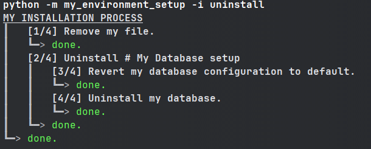
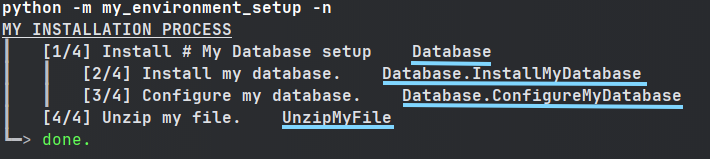

============================
Install Process Command Line
============================

This section describe everything related to install-steps.


Set-up CLI
----------

Once you have defined your installation process with ``InstallProcess``, use ``setup_install`` to
enable the CLI:

.. code-block:: python

    # File my_environment_setup.py

    # [...]

    class MyInstallProcess(InstallProcess):
        # ...

    if __name__ == '__main__':
        setup_install(MyInstallProcess)

In the rest of this section, it will be assumed ``setup_install(MyInstallProcess)`` is defined in file
**my_environment_setup.py**.

----

Install, Uninstall, Reinstall
-----------------------------

You can now run your install process from the command line:

.. code-block:: bash

    python -m my_environment_setup

.. image:: ./../quickstart/quickstart_full_install.png


You can also add the ``-i`` option to specify if you want to uninstall rather than install:

.. code-block:: bash

    python -m my_environment_setup -i uninstall




And if you want to reinstall (a.k.a uninstall then install again), you can:

.. code-block:: bash

    python -m my_environment_setup -i reinstall

----

Install Only a Specific Part
----------------------------

If you wish to run only a specific part of your install process, you can do so by providing
the name of the step you want to install/uninstall/reinstall.

To get the name of all steps (this does not install or uninstall anything):

.. code-block:: bash

    python -m my_environment_setup -n




Then you can call only a subset of your installation process:

.. code-block:: bash

    python -m my_environment_setup -t Database

.. image:: ./../quickstart/quickstart_specific_install.png

.. code-block:: bash

    python -m my_environment_setup -t Database.ConfigureMyDatabase -i reinstall

.. image:: ./../quickstart/quickstart_specific_reinstall.png

----

Verbose output for shell commands
---------------------------------

By default, if you use a shell command from within an install step using ```self.shell(...)``, the output is not
displayed unless the command fails.

If you want to *always* display shell commands outputs, you can do so by enabling verbose mode:

.. code-block:: bash

    python -m my_environment_setup -v

----

Add Install-Steps Before/After Install
------------------------------------------

If you wish to add install-steps (or group of install-steps) before/after executing you install-process, you can do so by
providing them to ``setup_install``:

.. code-block:: python

    # File my_environment_setup.py

    # [...]

    class StepBeforeInstallOrUninstall(InstallStep):
        # ...

    class StepAfterInstallOrUninstall(InstallStep):
        # ...

    class MyInstallProcess(InstallProcess):
        # ...

    if __name__ == '__main__':
        setup_install(
            MyInstallProcess,
            prologue=StepBeforeInstallOrUninstall(),
            epilogue=StepAfterInstallOrUninstall()
        )


Do note that ``prologue`` will trigger before install, and **before** uninstall ;
and that ``epilogue`` will trigger after install, and **after** uninstall.
