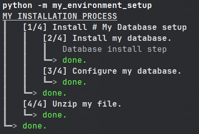

===============
install_process
===============

A Python library to help you define your installation processes.

What is ``install_process`` ?
-----------------------------

This library's goal is to help you create an installation process for any kind of application / environment.

With ``install_process``, you can define your entire installation process as a couple of small "install-steps",
which are then executed one after the other.
When defining your install-steps, ``install_process`` also handles what needs to be done when you need to
uninstall/reinstall part or the entirety of your install-process.

This lib can be compared to tools like `ANSIBLE <https://www.ansible.com/>`_, but for much simpler and local scopes
*(while still being easily callable with ANSIBLE if finally your project grows big enough)*.

This is an effort to `replace old Windows/Linux scripts with Python scripts <https://github.com/ninjaaron/replacing-bash-scripting-with-python>`_.

.. toctree::
   :maxdepth: 2
   :caption: Contents:

    Quick Start <quickstart/index>
    Install-Steps <steps/index>
    Install Process Command Line <command_line/index>
    FAQ <faq/index>