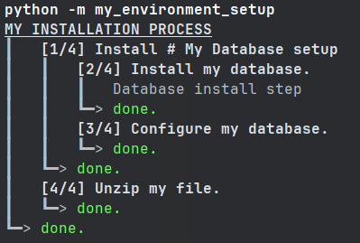

==========
Quickstart
==========

In this section, you will learn how to install ``install_process``, and how to define the installation process of a
basic example environment.

This example will go through the main concepts of install_process:
 - how to define install-steps
 - how to group install-steps in an installation process
 - how to launch you new installation process, in order to install & uninstall the basic example environment

Install ``ìnstall_process``
===========================

.. code-block:: bash

   pip install install_process

Define your first installation process
======================================

The Scenario
------------

Let's suppose you need to set up your environment, and for that you need to:
 1. install an SQL database
 2. configure the database
 3. unzip a file at a certain location

You could use install_process to define:
 - The database installation & uninstallation process
    - the database install & uninstall
    - the database configuration & revert to default config
 - Unzip the file & remove the file

Your Fist install-step
----------------------

In order to define our scenario using ``install_process``, you need to define install-steps. From our example:
 1. install an SQL database → could be defined as an install step
 2. configure the database → could be defined as an install step
 3. unzip a file at a certain location → could be defined as an install step

Install-steps are the basic element of install_process. In an install step, you define an installation sequence,
and an uninstallation sequence. To show what an install-step looks like in code, this is our
"install an SQL database" step:

.. code-block:: python

    from install_process import InstallStep

    # The database installation & uninstallation process
    class InstallMyDatabase(InstallStep):
      def install(self) -> None:
        """Install my database."""
        # [do what's required to install your database here]

        # you can display messages to users if you want
        self.display.msg('Database install step')
        # you can call shell commands such as ``self.shell('install mysql')``

      def uninstall(self) -> None:
        """Uninstall my database."""
        # [do what's required to uninstall your database here]

When defining an install step, you need to take care of how to install the step, and how to uninstall it, by
implementing the ``install`` and ``uninstall`` methods.

Do note that the ``install`` and ``uninstall`` methods docstring ("""Install my database.""" and """Uninstall my
database.""") are important, as they will be displayed when your entire install process is launched.

----

**Other install-steps**

The 2 other install-steps for "configure the database" & "unzip a file":

.. code-block:: python

    # The database configuration & revert to default process
    class ConfigureMyDatabase(InstallStep):
      def install(self) -> None:
        """Configure my database."""
        # do what's required to configure your database here

      def uninstall(self) -> None:
        """Revert my database configuration to default."""
        # do what's required to revert configuration here

    # Unzip the file & remove the file
    class UnzipMyFile(InstallStep):
      def install(self) -> None:
        """Unzip my file."""
        # unzip your file where required here

      def uninstall(self) -> None:
        """Remove my file."""
        # remove your file here

----

Group of install-steps
----------------------

Since the steps ``InstallMyDatabase`` and ``ConfigureMyDatabase`` both share a role in the Database setup,
you may optionally want to group them together.

.. code-block:: python

    # Let's regroup database-install & database-config under a same step (optional)
    class Database(InstallSteps):
      """My Database setup"""
      steps = [
        InstallMyDatabase(),
        ConfigureMyDatabase(),
      ]

``InstallSteps`` allow you to define a list of steps. Install steps will be installed in the order they are defined
(an uninstalled in the reverse order).

Do note that the class docstring ("""My Database setup""") is important, as it will be displayed when your entire
install process is launched.

----

Define Your Installation Process
--------------------------------

Now we have everything we need to create our installation process:

.. code-block:: python

    # Everything put together
    class SetupMyEnvironment(InstallProcess):
      """MY INSTALLATION PROCESS"""
      steps = [
        Database(),
        UnzipMyFile(),
      ]

``InstallProcess`` works just like ``InstallSteps``, and allows you to define a list of steps. Install steps will be
installed in the order they are defined (an uninstalled in the reverse order).

We are now ready to launch out installation. In order to do so, ``ìnstall_process`` provides a command line helper
function:

.. code-block:: python

    if __name__ == '__main__':
      setup_install(SetupMyEnvironment)

*(You can do more with installation steps, such as define installation conditions, parallel step execution,
add specifics before starting / after completing the whole installation process. Check the doc on Install Steps).*

Recap: the Entire Install File
------------------------------

Here's a recap of what our environment setup code could look like, all in a *my_environment_setup.py* file:

.. code-block:: python

    # file: my_environment_setup.py

    from install_process import InstallStep, InstallSteps, InstallProcess, setup_install

    # The database installation & uninstallation process
    class InstallMyDatabase(InstallStep):
      def install(self) -> None:
        """Install my database."""
        # do what's required to install your database here

      def uninstall(self) -> None:
        """Uninstall my database."""
        # do what's required to uninstall your database here

    # The database configuration & revert to default process
    class ConfigureMyDatabase(InstallStep):
      def install(self) -> None:
        """Configure my database."""
        # do what's required to configure your database here

      def uninstall(self) -> None:
        """Revert my database configuration to default."""
        # do what's required to revert configuration here

    # Let's regroup database-install & database-config under a same step (optional)
    class Database(InstallSteps):
      """My Database setup"""
      steps = [
        InstallMyDatabase(),
        ConfigureMyDatabase(),
      ]

    # Unzip the file & remove the file
    class UnzipMyFile(InstallStep):
      def install(self) -> None:
        """Unzip my file."""
        # unzip your file where required here

      def uninstall(self) -> None:
        """Remove my file."""
        # remove your file here

    class SetupMyEnvironment(InstallProcess):  # Put everything together
      """MY INSTALLATION PROCESS"""  # This docstring will actually be displayed
      steps = [
        Database(),  # Database install & config
        UnzipMyFile(),  # File unzipping
      ]

    if __name__ == '__main__':
      setup_install(SetupMyEnvironment)

*(You can do more with installation steps, such as define installation conditions, parallel step execution,
add specifics before starting / after completing the whole installation process. Check the doc on Install Steps).*

Launch Install, Uninstall, Reinstall
------------------------------------

Now you can install your entire environment, when executing the file:

.. code-block:: bash

    python -m my_environment_setup

If you need to uninstall your environment:

.. code-block:: bash

    python -m my_environment_setup -i uninstall

.. image:: ./quickstart_full_uninstall.png

*(You can do more with the command line, such as installing/uninstalling only specific steps, activate verbose mode.
Check the doc on Install Process Command Line).*
