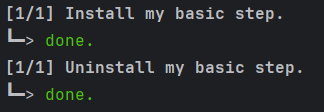
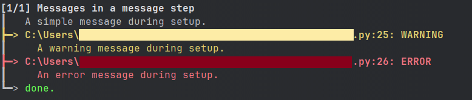
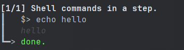
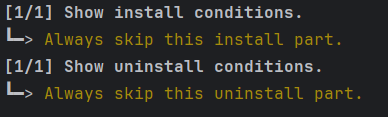
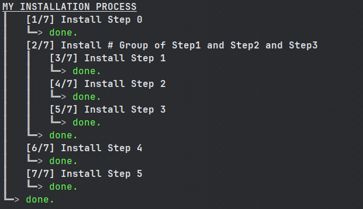
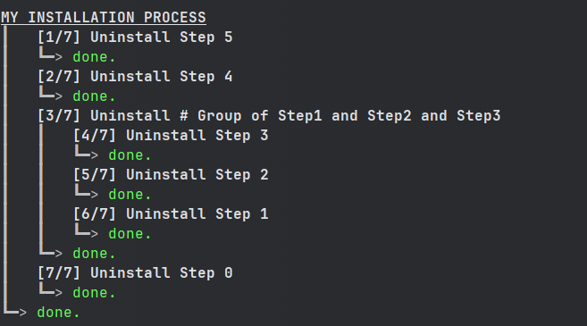

=============
Install Steps
=============

This section describe everything related to install-steps.

Install Steps
=============

Basics
------

Install-steps are the basic elements of install_process. In an install-step, you define an installation sequence,
and an uninstallation sequence.

Define an install-step by overloading the `InstallStep` class, and implementing the ``install`` and ``uninstall``
methods:

.. code-block:: python

    from install_process import InstallStep


    class MyBasicStep(InstallStep):
      def install(self) -> None:
        """Install my basic step."""

      def uninstall(self) -> None:
        """Uninstall my basic step."""

Here is what the step looks like when it is run in install & uninstall mode:



Note that what is displayed is the step's ``install`` docstring ("""Install my basic step.""") and ``uninstall``
docstring ("""Uninstall my basic step.""").

User Messages
-------------

During your installation process, you may want to send messages to the user. In an install-step, there are 3 levels
of messages available: normal, warning, error

.. code-block:: python

    from install_process import InstallStep


    class MyStepWithMessages(InstallStep):
        def install(self) -> None:
            """Messages in a message step"""
            self.display.msg("A simple message during setup.")
            self.display.warn("A warning message during setup.")
            self.display.error("An error message during setup.")

        def uninstall(self) -> None:
            """Uninstall my step."""

Here is what the step looks like when it is run in install mode:




Shell commands
--------------

Although there are `many things you can do in Python <https://github.com/ninjaaron/replacing-bash-scripting-with-python>`_,
sometimes you may need to execute shell commands. You can do this directly within an install-step:


.. code-block:: python

    from install_process import InstallStep, Config

    # Force verbose mode for this example
    # In real-life examples, you can use the verbose mode from the command-line launcher
    import install_process.install
    install_process.install.Config.verbose = True


    class MyStepWithShellCommand(InstallStep):
        def install(self) -> None:
            """Shell commands in a step."""
            self.shell("echo hello")

        def uninstall(self) -> None:
            """Uninstall my step."""

Here is what the step looks like when it is run in install mode:



The shell method comes with the ``check_errors`` parameter, that you may want to set to False during uninstall phases,
and the ``timeout`` parameter, if required. ``self.shell`` also returns the entire shell output (stdout & stderr) as a
string, if you need it.

By default, when called with ``self.shell``, shell commands outputs are only displayed to the user if the command fails
and if ``check_errors``. You can force to *always* display shell command output.

Conditions
----------

You may want to add install or uninstall conditions. In order to do this, implement the ``install_condition`` and
``uninstall_condition`` methods of your install-step:


.. code-block:: python

    from install_process import InstallStep


    class MyStepWithConditions(InstallStep):
        def install_condition(self) -> bool:
            """Always skip this install part."""
            return False

        def uninstall_condition(self) -> bool:
            """Always skip this uninstall part."""
            return False

        def install(self) -> None:
            """Show install conditions."""

        def uninstall(self) -> None:
            """Show uninstall conditions."""

Here is what the step looks like when it is run in install & uninstall mode:




Group of Install Steps
======================

To make life easier when you have hundreds of install-steps, you may want to group some of them. You can define a group
of install-steps by overloading the `InstallSteps` class, and filling the ```steps`` class attribute:

.. code-block:: python

    from install_process import InstallStep, InstallSteps


    class Step1(InstallStep):
        def install(self) -> None:
            """Step 1"""
        def uninstall(self) -> None:
            """Step 1"""

    class Step2(InstallStep):
        def install(self) -> None:
            """Step 2"""
        def uninstall(self) -> None:
            """Step 2"""

    class Step3(InstallStep):
        def install(self) -> None:
            """Step 3"""
        def uninstall(self) -> None:
            """Step 3"""


    class GroupOfSteps(InstallSteps):
        """Group of Step1 and Step2 and Step3"""
        steps = [
            Step1(),
            Step2(),
            Step3(),
        ]

Note that what is displayed at execution is the group class docstring ("""Group of Step1 and Step2 and Step3""").

Just like with an install-step, you may implement the ``install_condition`` and ``uninstall_condition`` methods of your
group of install-step to add conditions.

You can add groups in groups:

.. code-block:: python

    # [...]


    class AnotherGroup(InstallSteps):
        """Group of a group and some steps"""
        steps = [
            Step0(),
            GroupOfSteps(),
            Step4(),
            Step5(),
        ]


Install Process
===============

Basics
------

The installation process requires you to define an ``InstallProcess``. It groups all the install-steps you have defined,
and works like ann ``InstallSteps``:

.. code-block:: python

    # [...]


    class MyInstallProcess(InstallSteps):
        """MY INSTALLATION PROCESS"""
        steps = [
            Step0(),
            GroupOfSteps(),
            Step4(),
            Step5(),
        ]

Here is what the process looks like when it is run in install & uninstall mode:





Running an installation process
-------------------------------

**If you want to know how to launch an installation process from a file, check the Install Process Command Line section.**

.. code-block:: python

    # [...]

    class MyInstallProcess(InstallSteps):
        #...

    if __name__ == '__main__':
        MyInstallProcess().install()


Executing Only a Subset of the Installation Process
---------------------------------------------------

When instantiating your install process, you can give the name of the step (or group of steps) you want to launch.
Only this step will be run.

.. code-block:: python

    # [...]

    class MyInstallProcess(InstallSteps):
        #...

    if __name__ == '__main__':
        MyInstallProcess('GroupOfSteps.Step2').install()

In the example above, only the install of Step2, in the GroupOfSteps, will be run.

Install Prologue & Epilogue
---------------------------

If you wish to add things before/after your installation/uninstallation, you may implement the ``prologue`` and
``epilogue`` methods of your group of install-process. These will be executed even if you pass a step_name to your
install process (ref. Executing Only a Subset of the Installation Process).

Parallel Install Steps
======================

You can execute install-steps or group of install steps concurrently ("in parallel") if you wish:

.. code-block:: python

    # [...]

    class ConcurrentsSteps(InstallSteps):
        """Steps"""
        steps = [
            Step0() | Step1() | Step2(),
            Step4(),
        ]

In above example, Step0 & Step1 & Step2 will be executed concurrently, then Step4.

*Note that when a group of install-steps are executed in parallel, nothing will be displayed*
**until all the steps of the group of install-steps** *are completed.*
